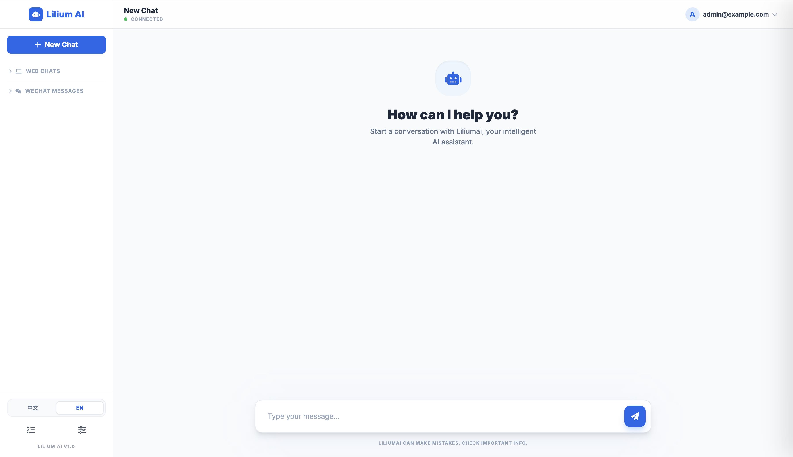

# Lilium AI

[English](README.md) | [简体中文](README_CN.md)

> **Not just a chatbot, but your AI Co-pilot for total computer automation.**
> [liliumai.cn](https://liliumai.cn)

Lilium AI is a powerful personal AI agent framework designed for **autonomous execution**. It connects Large Language Models (LLMs) like OpenAI and Ollama to **browser automation, system-level shell control, deep file integration, and omni-channel communication**, enabling AI to perform complex end-to-end tasks just like a human.

## ✨ Key Features

- **🌐 Browser Automation**: Built-in browser driver for autonomous navigation, searching, clicking, and data extraction.
- **🤖 Autonomous Sub-Agents**: Spawn background sub-agents to handle complex tasks asynchronously without interrupting your main chat.
- **💻 Total Computer Control**: Equipped with Shell execution, Filesystem I/O, and Cron scheduling for true automation.
- **🔌 Omni-Channel**: The only framework supporting WeChat, Feishu, DingTalk, Telegram, WhatsApp, Discord, and more.
- **🧠 Memory & Knowledge**: Long-term memory (SQLite/LanceDB) and RAG-based knowledge base for personalized workflows.
- **🧠 Multi-LLM Support**: Seamlessly switch between OpenAI, Claude, Ollama (local models), and more.
- **🧩 Minimalist Extension**: Add new skills in minutes by dropping JS files into the `plugins/` folder.
- **🗣️ Voice-to-Action**: Automatic voice transcription (Whisper) to control your computer via voice commands.

## 🚀 Core Scenarios (What can it do?)

- **Automated Workflows**: "Every morning at 9 AM, log into my GitHub, summarize all new issues, and send the report to my WeChat."
- **Web Intelligence**: "Monitor this page for price drops; notify me via Slack as soon as it's below $1000."
- **System Ops**: "Analyze the server logs in the current directory, find all 500 errors from the last hour, and generate a root-cause summary."
- **Cross-Platform Assistant**: "Take all voice messages I send you on Telegram, transcribe them into text, and save the summary to a local Markdown file."

## 💡 Why Choose Lilium AI?

### 🌟 For Everyone: Your All-in-One Digital Assistant
- **Simple as Chatting**: No coding required. Just tell it, "Compare the price of these headphones across major sites," and it will browse the web for you.
- **24/7 Personal Agent**: Let it monitor web pages or summarize documents while you sleep, and report back via WhatsApp or Telegram.
- **Privacy First**: Your chats, files, and account info stay on your own device—safe and secure.

### 🛠️ For Developers: Ultimate Extensibility
- **Node.js Ecosystem**: Built on Node.js, leveraging millions of npm packages for easy extension.
- **Powerful Toolbox**: Integrated Puppeteer, SQLite, LanceDB, Whisper, and RAG capabilities.
- **Flexible Plugin System**: Define new AI skills simply by dropping a JS file into the `plugins/` folder.

## 🚀 Getting Started

### Prerequisites

- **Node.js**: v18 or higher
- **pnpm**: Recommended package manager (`npm install -g pnpm`)
- **Python 3**: (Optional) For macOS permission checking script (`check-permissions`).

### Installation

1.  **Clone the repository**
    ```bash
    git clone https://github.com/beidald/liliumai.git
    cd liliumai
    ```

2.  **Install dependencies**
    ```bash
    pnpm install
    ```

3.  **Configure the project**
    Copy the example configuration file to create your local config.
    ```bash
    cp config.example.json config.json
    ```

4.  **Edit `config.json`**
    Open `config.json` and fill in your details:
    *   **LLM**: Add your OpenAI API Key or Ollama base URL.
    *   **Channels**: Enable desired channels (e.g., `wechat`, `telegram`) and add tokens.
    *   **Admin**: **Critical!** Change the default password in the `admin` section.

    > **Security Note**: Never commit your `config.json` to version control. The project is configured to ignore it by default.

5.  **Check Permissions (macOS only)**
    If running on macOS and using Wechaty/Puppeteer, you may need to grant accessibility permissions.
    ```bash
    pnpm check-permissions
    ```

### Running the Bot

Start the agent in development mode:
```bash
pnpm start
```

Or build and run for production:
```bash
pnpm build
node dist/index.js
```

## ⚠️ Disclaimer

- **Terms of Service**: Automated interactions with some platforms (e.g., WeChat, WhatsApp) may violate their Terms of Service. Users are responsible for ensuring compliance with platform rules.
- **Account Risk**: Using this software with personal accounts (especially on WeChat via Puppet) carries a risk of account restriction or banning. It is highly recommended to use a dedicated test account.
- **Data Privacy**: While this project is designed to be "Local First" and privacy-focused, users are responsible for securing their own server environments and configuration files.

## 🗺️ Roadmap

- [ ] **Enhanced Web Dashboard**: Richer data visualization and easier configuration management.
- [ ] **Plugin Ecosystem**: A marketplace or easier discovery mechanism for community plugins.
- [ ] **Multi-modal Support**: Ability to process images (Vision) and generate audio (TTS).
- [ ] **RAG Improvements**: Better knowledge base retrieval strategies and document parsing.
- [ ] **Mobile App**: A companion mobile app for managing the bot on the go.

## ⚙️ Configuration Guide

The `config.json` file is the heart of Lilium AI. Here are key sections:

### Admin Authentication
Secure your Web Interface and API endpoints.
```json
"admin": {
  "email": "admin@example.com",
  "password": "YOUR_STRONG_PASSWORD"
}
```

### LLM Providers
Configure multiple providers with priorities.
```json
"llm": [
  {
    "provider": "openai",
    "model": "gpt-4",
    "apiKey": "sk-...",
    "priority": 1
  },
  {
    "provider": "ollama",
    "model": "llama3",
    "baseUrl": "http://localhost:11434/v1",
    "priority": 2
  }
]
```

### Voice Transcription
Enable automatic voice-to-text for audio messages.
```json
"transcription": {
  "provider": "local",  // "local" or "groq"
  "model": "base",      // "tiny", "base", "small", "medium", "large"
  "apiKey": ""          // Required for cloud providers
}
```
> Note: Local models will be automatically downloaded on first use from HuggingFace (with domestic mirror support).

### Channels
Enable channels as needed. For example, to enable the Web UI:
```json
"channels": {
  "web": {
    "enabled": true,
    "port": 3000
  }
}
```

## 🖥️ Web Interface

Once running, access the Web UI at:
`http://localhost:3000`



- **Chat**: Interact with Lilium directly from your browser.
- **Stop Generation**: Click the "Stop" button to immediately halt the AI's current output.
- **Admin**: Some features require the Admin credentials configured in `config.json`.

## 🧩 Skills Showcase

Lilium AI's true power lies in **skill composition**. You can give complex natural language instructions:

- **Browser Automation**: "Log into GitHub and star the specified repository."
- **System Analysis**: "Analyze the log files in the current directory, identify the root cause of 500 errors, and generate a summary."
- **Autonomous Tasks**: "Spawn a sub-agent to continuously monitor price changes on a competitor's website and report to me every hour."
- **Smart Scheduling**: "Every morning at 9 AM, summarize all my unread Feishu messages and send them to Telegram."
- **Multi-step Collaboration**: "Search for the latest research on DeepSeek, download the PDF, extract the key findings, and save them to the local knowledge base."

## 🤝 Join the Evolution (Contributing)

Lilium AI is an open project, and we welcome developers to join us in building the most powerful personal AI agent!

- **Develop New Skills**: Want the AI to support more tools? You can easily extend its capabilities by writing simple TypeScript/JavaScript classes (Check [TOOLS.md](workspace/TOOLS.md)).
- **Build Plugins**: Our plugin system allows you to add features directly to the `plugins/` directory without touching the core code (Check [PLUGINS.md](plugins/PLUGINS.md)).
- **Improve Channels**: Help us integrate more communication platforms like Slack, Discord, or deeper Feishu/DingTalk integrations.
- **Submit Issues/PRs**: Whether it's a bug fix or a feature proposal, we value every contribution.

Check out our [CONTRIBUTING.md](CONTRIBUTING.md) for more details. Let's define the future of AI automation together!

## 📬 Contact

Email: [beidaliudong@pku.org.cn](mailto:beidaliudong@pku.org.cn)

## 📝 License

MIT License.
