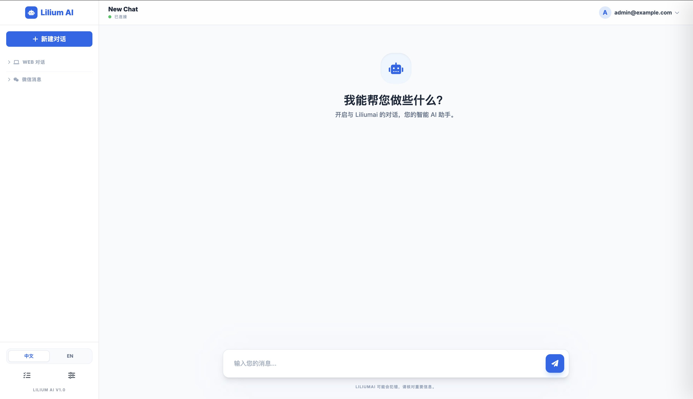

# Lilium AI

> **不仅仅是聊天机器人，更是您的 AI 自动驾驶员。**
> 以打造“最强自动化、智能化操控电脑自己干活”为宗旨的 AI Agent 框架。

Lilium AI 是一个专为“自动执行任务”设计的个人 AI 智能体框架。它通过将主流大模型（OpenAI, Claude, Ollama 等）与**浏览器自动化、系统级 Shell 控制、文件深度集成以及全渠道通信**相结合，让 AI 能够像人类一样在电脑上执行复杂的端到端任务。

## ✨ 核心特性

- **🌐 浏览器自动化**: 内置浏览器驱动，支持 AI 自主导航、搜索、点击和数据抓取。
- **📱 零代码交互**: 通过直观的 Web 界面或手机聊天软件（微信/Telegram 等）直接操控，像和真人对话一样下达任务。
- **🤖 自主子智能体 (Sub-Agents)**: 支持派生后台子智能体，异步处理复杂任务而不中断主对话。
- **💻 系统深度操控**: 具备 Shell 执行、文件系统读写、定时任务（Cron）等核心“操控电脑”能力。
- **🔌 全渠道交互**: 唯一一个同时支持微信、飞书、钉钉、Telegram、WhatsApp、Discord 等全主流渠道的 Agent 框架。
- **🧠 记忆与知识库**: 长期记忆存储 (SQLite/LanceDB) + RAG 知识库，让 AI 真正了解您的工作流。
- **🧠 多模型大脑**: 无缝切换 OpenAI、Ollama (本地模型) 和其他主流提供商。
- **🧩 极简扩展**: 通过 `plugins/` 目录，仅需几行 JS 代码即可为 AI 添加新技能。
- **🗣️ 语音全自动化**: 支持 Whisper 本地语音转录，通过语音指令直接操控电脑。

## 🚀 核心场景 (What can it do?)

- **自动化工作流**: “每天早上 9 点，登录我的 GitHub，汇总我所有 Repo 的 issue 并发到我的微信。”
- **网页情报分析**: “监控这个网页的价格变动，一旦低于 1000 元，立刻通过钉钉通知我。”
- **本地系统运维**: “帮我分析当前服务器的日志文件，找出过去一小时内所有的 500 错误并生成一份原因分析报告。”
- **跨平台小秘书**: “把我在 Telegram 上发给你的所有语音，转成文字后整理成摘要，保存到本地 Markdown 文件中。”

## 💡 为什么选择 Lilium AI？

### 🌟 对非开发者：您的全能数字助理
- **像聊天一样简单**：无需编写代码，只需用平常说话的方式告诉它：“帮我对比下这款耳机在各平台的价格”，它就会自动打开浏览器为您寻找答案。
- **全天候在线**：它可以在您睡觉时监控网页变化、整理文档，并在微信或钉钉上向您汇报。
- **数据完全私有**：您的聊天记录、文件和账号信息都存储在您自己的设备上，安全无忧。

### 🛠️ 对开发者：极致的扩展性
- **Node.js 生态**：基于 Node.js 开发，利用丰富的 npm 库轻松扩展。
- **强大的工具箱**：内置 Puppeteer、SQLite、LanceDB、Whisper 等硬核工具，支持 RAG 知识库。
- **灵活的插件系统**：只需创建一个 JS 文件即可定义新的 AI 技能。

## 快速开始

### 前置要求

- **Node.js**: v18 或更高版本
- **pnpm**: 推荐的包管理器 (`npm install -g pnpm`)
- **Python 3**: (可选) macOS 权限检查脚本需要。

### 安装步骤

1.  **克隆仓库**
    ```bash
    git clone https://github.com/beidald/liliumai.git
    cd liliumai
    ```

2.  **安装依赖**
    ```bash
    pnpm install
    ```

3.  **配置项目**
    复制示例配置文件以创建本地配置。
    ```bash
    cp config.example.json config.json
    ```

4.  **编辑 `config.json`**
    打开 `config.json` 并填写您的详细信息：
    *   **LLM**：添加您的 OpenAI API Key 或 Ollama 基础 URL。
    *   **Channels**：启用所需的渠道 (例如 `wechat`, `telegram`) 并添加 Token。
    *   **Admin**：**关键！** 修改 `admin` 部分中的默认密码。

    > **安全提示**：切勿将 `config.json` 提交到版本控制系统。项目默认配置为忽略该文件。

5.  **检查权限 (仅限 macOS)**
    如果在 macOS 上运行并使用 Wechaty/Puppeteer，可能需要授予辅助功能权限。
    ```bash
    pnpm check-permissions
    ```

### 运行机器人

以开发模式启动 Agent：
```bash
pnpm start
```

或者构建并以生产模式运行：
```bash
pnpm build
node dist/index.js
```

## ⚠️ 免责声明 (Disclaimer)

- **服务条款 (ToS)**: 自动化操作某些平台（如微信、WhatsApp）可能违反其服务条款。用户需自行确保遵守平台规则。
- **账号风险**: 使用个人账号（尤其是通过 Puppet 协议的微信）存在被限制或封号的风险。**强烈建议使用专用的小号进行测试**。
- **数据隐私**: 虽然本项目设计为“本地优先”并注重隐私，但用户需自行负责服务器环境和配置文件的安全。

## 🗺️ 路线图 (Roadmap)

- [ ] **增强型 Web 仪表板**: 更丰富的数据可视化和更便捷的配置管理。
- [ ] **插件生态**: 建立社区插件市场或更方便的发现机制。
- [ ] **多模态支持**: 支持图像识别 (Vision) 和语音生成 (TTS)。
- [ ] **RAG 增强**: 更好的知识库检索策略和文档解析能力。
- [ ] **移动端 App**: 用于随时随地管理机器人的配套 App。

## ⚙️ 配置指南

`config.json` 文件是 Lilium AI 的核心。以下是关键部分：

### 管理员认证
保护您的 Web 界面和 API 端点。
```json
"admin": {
  "email": "admin@example.com",
  "password": "YOUR_STRONG_PASSWORD"
}
```

### LLM 提供商
配置多个提供商及其优先级。
```json
"llm": [
  {
    "provider": "openai",
    "model": "gpt-4",
    "apiKey": "sk-...",
    "priority": 1
  },
  {
    "provider": "ollama",
    "model": "llama3",
    "baseUrl": "http://localhost:11434/v1",
    "priority": 2
  }
]
```

### 语音转录 (Transcription)
开启语音消息自动转文字功能。
```json
"transcription": {
  "provider": "local",  // "local" 或 "groq"
  "model": "base",      // "tiny", "base", "small", "medium", "large"
  "apiKey": ""          // 云端提供商需要填写
}
```
> 注意：本地模型在首次使用时会自动从 HuggingFace (支持国内镜像) 下载。

### 渠道 (Channels)
根据需要启用渠道。例如，要启用 Web UI：
```json
"channels": {
  "web": {
    "enabled": true,
    "port": 3000
  }
}
```

## 🖥️ Web 界面

运行后，通过以下地址访问 Web UI：
`http://localhost:3000`



- **聊天**：直接从浏览器与 Lilium 互动。
- **停止生成**：点击“停止”按钮立即停止 AI 当前的输出。
- **管理员**：某些功能需要 `config.json` 中配置的管理员凭据。

## 🧩 技能演示

Lilium AI 的真正力量在于技能的**组合应用**。您可以使用自然语言下达复杂的指令：

- **浏览器自动化**: “登录 GitHub 并给我指定的仓库点星。”
- **系统级分析**: “分析当前目录下的日志文件，找出 500 错误的根源并生成摘要。”
- **自主后台任务**: “启动一个子智能体，持续监控竞品网站的价格变化，每小时向我汇报一次。”
- **智能调度**: “每天早上 9 点，汇总我未读的所有飞书消息并发送到 Telegram。”
- **多级协作**: “搜索关于 DeepSeek 的最新论文，下载 PDF，提取核心结论并保存到本地知识库。”

## 🤝 参与贡献

Lilium AI 是一个开放的项目，我们非常欢迎开发者加入，共同打造最强个人 AI 智能体！

- **开发新技能 (Skills)**: 想要让 AI 支持更多的工具？你可以通过编写简单的 TypeScript/JavaScript 类来扩展它的能力（参考 [TOOLS.md](workspace/TOOLS.md)）。
- **编写插件 (Plugins)**: 插件系统让你可以无需修改核心代码，直接在 `plugins/` 目录中添加新功能（参考 [PLUGINS.md](plugins/PLUGINS.md)）。
- **完善渠道 (Channels)**: 帮助我们接入更多的通信平台，如钉钉、飞书的深度集成。
- **提交 Issue/PR**: 无论是一个 Bug 修复，还是一个新功能的提议，我们都非常期待你的参与。

请参考我们的 [CONTRIBUTING.md](CONTRIBUTING.md) 了解更多细节。让我们一起定义 AI 自动化的未来！

## 📬 联系方式

邮箱：[beidaliudong@pku.org.cn](mailto:beidaliudong@pku.org.cn)

## 📝 许可证

MIT License.
